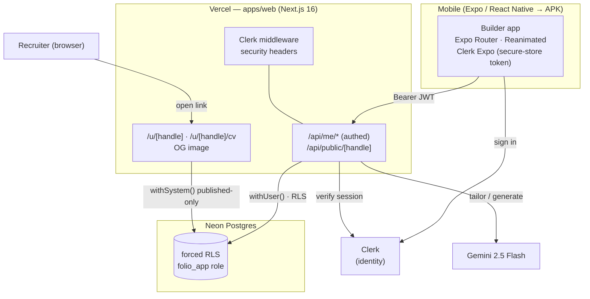

# Architecture

Folio is a monorepo with a **native mobile app** (the builder) and a **Next.js
web app** that is both the **API** and the **public portfolio site**.

## Components

- **apps/mobile** — Expo SDK 56 (RN 0.85, React 19, Expo Router, Reanimated 4).
  The portfolio builder; ships as an Android **APK** via EAS Build. Talks to the
  API with a Clerk session JWT. A demo provider lets the UI run without a backend.
- **apps/web** — Next.js 16 (App Router, Turbopack). Hosts the typed JSON API the
  app calls, plus the **public** `/u/[handle]` portfolio page, the printable
  `/cv` page, and dynamic OG images. Deployed on Vercel.
- **Neon Postgres** — single database; **forced row-level security** isolates
  each user's data. The app connects as `folio_app` (`NOBYPASSRLS`).
- **Clerk** — identity (email code + Google). **Gemini** — AI tailoring + text.

## Tenancy & request lifecycle

1. The app gets a Clerk session token and calls `/api/me/*` with it.
2. `authed()` resolves the user, rate-limits per user, and (for mutations)
   applies idempotency.
3. Data access runs inside `withUser(userId, …)`, which sets
   `app.user_id` for the transaction; RLS policies restrict every row to the
   owner. System paths (public pages, seed) use `withSystem()` which sets a
   bypass GUC and only ever reads `published` data.
4. Mutations append to the per-user tamper-evident audit chain.

## Why this shape

A native app is the product (a great CV artifact + real APK); the web side gives
recruiters a fast, shareable page and powers the API — one repo, one deploy
pipeline, maximal code reuse on the hardened backend. See `docs/adr/`.
